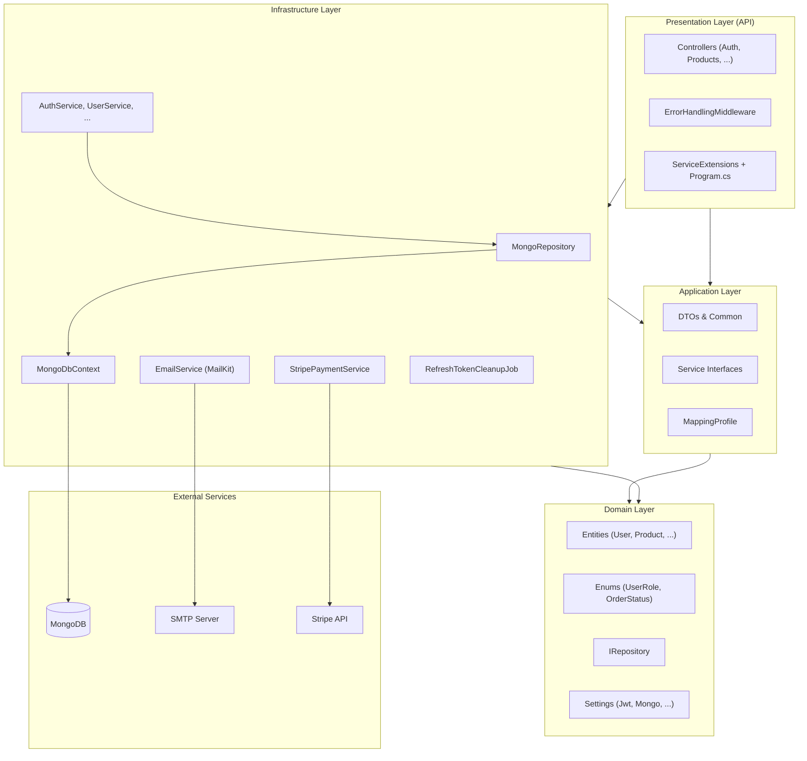
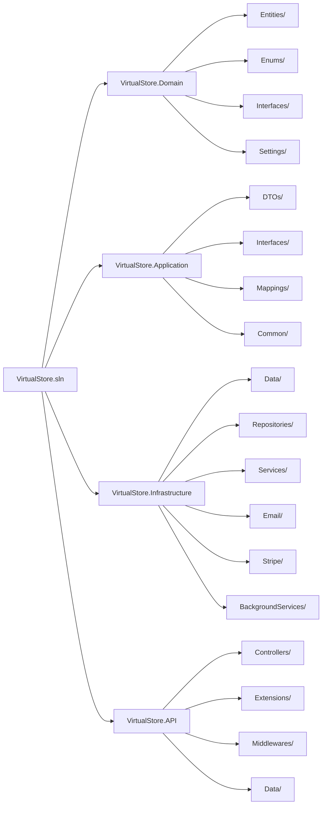
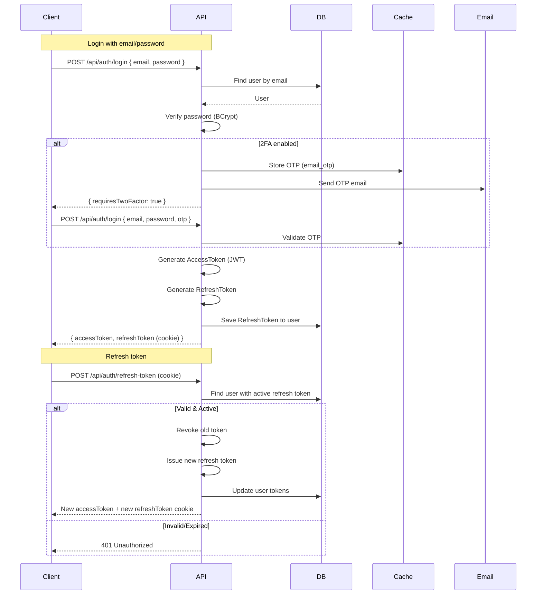
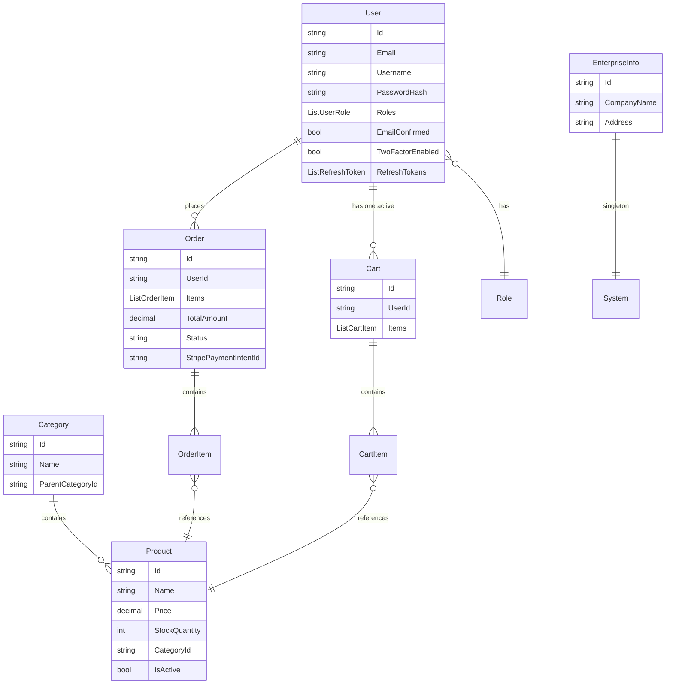
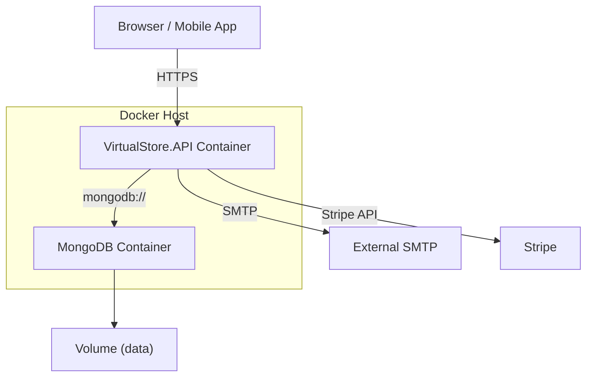

# 🛒 Virtual Store Backend

[](https://dotnet.microsoft.com/)
[](https://www.mongodb.com/)
[](LICENSE)
[](https://stripe.com/)

A **production-ready, enterprise-grade** backend for a virtual store built with **.NET 10**, **MongoDB**, **Clean Architecture**, and modern security patterns.

It supports product and service management, role-based access, JWT authentication with refresh tokens, two-factor email OTP, Stripe payments, scheduled jobs, and comprehensive API documentation via **Scalar**.

**Project Link:** https://github.com/Pablocean/VirtualStore  
**Author:** Pablo Perera Marcoleta

---

## Table of Contents

- [Features](#-features)
- [Architecture](#-architecture)
- [Project Structure](#-project-structure)
- [Technologies](#-technologies)
- [Getting Started](#-getting-started)
- [Authentication & Authorization](#-authentication--authorization)
- [API Endpoints Overview](#-api-endpoints-overview)
- [Stripe Integration](#-stripe-integration)
- [Testing](#-testing)
- [Deployment](#-deployment)
- [Monitoring & Observability](#-monitoring--observability)
- [License](#-license)
- [Contributing](#-contributing)
- [Acknowledgements](#-acknowledgements)
- [Contact](#-contact)
- [Mermaid Diagrams](#-mermaid-diagrams)

---

## 🚀 Features

- **Clean Architecture**: `Domain`, `Application`, `Infrastructure`, `API` layers, fully decoupled.
- **Authentication & Authorization**:
  - JWT access token + HTTP-only refresh token.
  - Two-factor authentication via email OTP.
  - Role-based access (`Customer`, `Manager`, `Admin`).
- **User & Enterprise Management**: CRUD operations for users, products, categories, enterprise info.
- **Shopping Cart & Orders**:
  - Persistent cart per user.
  - Order creation with status tracking.
  - Stripe payment intent creation & webhook handling.
- **Security**:
  - BCrypt password hashing.
  - Refresh token rotation & automatic revocation.
  - CORS, HTTPS, JWT signing key from secure configuration.
- **Background Jobs**:
  - Quartz.NET – daily cleanup of expired refresh tokens.
- **Caching**: In-memory cache for performance-critical data.
- **Health Checks**: Endpoint `/health` with MongoDB connectivity verification.
- **API Documentation**: Interactive UI using **Scalar** (OpenAPI 3.1).
- **Configuration**: Sensible defaults with `.env` file for secrets (dotenv.net).
- **Seeding**: Automatic admin user creation from environment variables.

---

## 🧱 Architecture

The solution follows **Clean Architecture** principles:

- **Domain** – core entities, enums, and repository interfaces.
- **Application** – DTOs, service interfaces, AutoMapper profiles, validation.
- **Infrastructure** – implementations of persistence (MongoDB), email (MailKit), Stripe, caching, Quartz.
- **API** – ASP.NET Core Web API controllers, middleware, configuration.
- **DI & Options Pattern** – all services registered via extension methods; settings bound from configuration.

> The Mermaid architecture diagram below can be rendered directly in GitHub README files.



---

## 📂 Project Structure

### Repository Overview

```text
VirtualStore/
├── VirtualStore.Domain/ # Core entities, enums, interfaces, settings
├── VirtualStore.Application/ # Use cases, DTOs, interfaces, AutoMapper profiles
├── VirtualStore.Infrastructure/ # Repositories, email, Stripe, Quartz jobs, caching
└── VirtualStore.API/ # Controllers, middleware, configuration, Program.cs
```

### Full Tree

```text
VirtualStore.sln
├── VirtualStore.Domain/
│   ├── Entities/
│   │   ├── BaseEntity.cs
│   │   ├── User.cs
│   │   ├── Product.cs
│   │   ├── Category.cs
│   │   ├── Cart.cs / CartItem.cs
│   │   ├── Order.cs / OrderItem.cs
│   │   └── EnterpriseInfo.cs
│   ├── Enums/
│   │   ├── UserRole.cs
│   │   ├── OrderStatus.cs
│   │   └── ProductType.cs
│   ├── Interfaces/
│   │   └── IRepository.cs
│   └── Settings/
│       ├── MongoDbSettings.cs
│       ├── JwtSettings.cs
│       ├── EmailSettings.cs
│       └── StripeSettings.cs
├── VirtualStore.Application/
│   ├── Common/
│   │   └── PagedResult.cs
│   ├── DTOs/
│   │   ├── Auth/
│   │   ├── UserDtos.cs
│   │   ├── ProductDtos.cs
│   │   ├── CategoryDto.cs
│   │   ├── CartDtos.cs
│   │   ├── OrderDtos.cs
│   │   └── EnterpriseInfoDtos.cs
│   ├── Interfaces/
│   │   ├── IAuthService.cs
│   │   ├── ITokenService.cs
│   │   ├── IUserService.cs
│   │   ├── IProductService.cs
│   │   ├── ICartService.cs
│   │   ├── IOrderService.cs
│   │   ├── IEnterpriseInfoService.cs
│   │   ├── IEmailService.cs
│   │   ├── IStripePaymentService.cs
│   │   └── ICacheService.cs
│   └── Mappings/
│       └── MappingProfile.cs
├── VirtualStore.Infrastructure/
│   ├── BackgroundServices/
│   │   └── RefreshTokenCleanupJob.cs
│   ├── Data/
│   │   └── MongoDbContext.cs
│   ├── Email/
│   │   └── EmailService.cs
│   ├── Repositories/
│   │   └── MongoRepository.cs
│   ├── Services/
│   │   ├── AuthService.cs
│   │   ├── TokenService.cs
│   │   ├── UserService.cs
│   │   ├── ProductService.cs
│   │   ├── CartService.cs
│   │   ├── OrderService.cs
│   │   ├── EnterpriseInfoService.cs
│   │   └── CacheService.cs
│   └── Stripe/
│       └── StripePaymentService.cs
└── VirtualStore.API/
    ├── Controllers/
    │   ├── AuthController.cs
    │   ├── UsersController.cs
    │   ├── ProductsController.cs
    │   ├── CartController.cs
    │   ├── OrdersController.cs
    │   └── EnterpriseInfoController.cs
    ├── Data/
    │   └── DatabaseSeeder.cs
    ├── Extensions/
    │   └── ServiceExtensions.cs
    ├── Middlewares/
    │   └── ErrorHandlingMiddleware.cs
    ├── appsettings.json
    ├── .env (example)
    └── Program.cs
```

---

## 🛠️ Technologies

| Category | Technology |
|---|---|
| Runtime | .NET 10.0 LTS |
| Database | MongoDB 7.0 (via MongoDB.Driver) |
| Authentication | JWT Bearer (System.IdentityModel.Tokens.Jwt) |
| Password Hashing | BCrypt.Net-Next |
| Email | MailKit (SMTP) |
| Payments | Stripe.net |
| Background Jobs | Quartz.NET |
| Caching | In-Memory Cache (Microsoft.Extensions.Caching.Memory) |
| Validation | FluentValidation |
| Object Mapping | AutoMapper 16.1.1 |
| API Documentation | Scalar (Microsoft.AspNetCore.OpenApi + Scalar.AspNetCore) |
| Health Checks | AspNetCore.HealthChecks.MongoDb |
| Configuration | dotenv.net (`.env` file) |
| Logging | Serilog (Console + File sink) |
| CI/CD | GitHub Actions (recommended), Docker (optional) |

---

## 🏁 Getting Started

### Prerequisites

- [.NET 10 SDK](https://dotnet.microsoft.com/download/dotnet/10.0)
- [MongoDB](https://www.mongodb.com/try/download/community) (local or Atlas)
- [Visual Studio 2026](https://visualstudio.microsoft.com/vs/) (or VS Code)
- SMTP server (e.g., Gmail) for email OTP (optional for testing)
- Stripe account (test keys) for payments (optional)

### Installation

1. **Clone the repository**
   ```bash
   git clone https://github.com/Pablocean/VirtualStore.git
   cd VirtualStore
   ```

2. **Set up environment variables**  
   Copy the example file and fill in your secrets:
   ```bash
   cp .env.example .env
   ```
   Edit `.env` with your MongoDB connection string, JWT secret, email credentials, and Stripe keys.

3. **Restore dependencies and build**
   ```bash
   dotnet restore
   dotnet build
   ```

4. **Run the application**
   ```bash
   cd VirtualStore.API
   dotnet run
   ```

The API starts at:

- **HTTPS:** `https://localhost:7038`
- **HTTP:** `http://localhost:5293`

### API Documentation

Open your browser to:

```text
https://localhost:7038/scalar/v1
```

This opens the interactive **Scalar** UI.

### Seeding the Admin User

On first run, the `DatabaseSeeder` automatically creates an admin user using credentials from your `.env` file (or defaults shown below).

**Default (if `.env` is not provided):**

- **Email:** `admin@virtualstore.com`
- **Password:** `Admin123!`

Change these immediately by setting:

```text
DatabaseSeeder__AdminEmail
DatabaseSeeder__AdminPassword
```

in `.env`.

---

## 🔐 Authentication & Authorization

### Login

```http
POST /api/auth/login
```

```json
{
  "email": "admin@virtualstore.com",
  "password": "Admin123!"
}
```

This returns an `accessToken` and sets a `refreshToken` in an HTTP-only cookie.

### Using the Token

For protected endpoints, add the header:

```http
Authorization: Bearer <accessToken>
```

The Scalar UI supports setting the JWT token via the padlock icon.

### Roles

- **Customer** – view products, manage own cart/orders
- **Manager** – same as Customer + manage products/categories
- **Admin** – full CRUD over users, enterprise info, and all resources

---

## 📡 API Endpoints Overview

| Method | Endpoint | Roles | Description |
|---|---|---|---|
| POST | `/api/auth/login` | Anonymous | Login, get tokens |
| POST | `/api/auth/refresh-token` | Anonymous (cookie) | Rotate refresh token |
| POST | `/api/auth/logout` | Authenticated | Revoke refresh token |
| GET | `/api/users` | Admin | List users |
| POST | `/api/users` | Admin | Create a new user |
| ... | ... | ... | ... |
| GET | `/api/products` | Anonymous | List products (filterable) |
| GET | `/api/products/{id}` | Anonymous | Get product details |
| POST | `/api/products` | Admin, Manager | Create a product |
| PUT | `/api/products/{id}` | Admin, Manager | Update a product |
| DELETE | `/api/products/{id}` | Admin | Delete a product |
| GET | `/api/cart` | Authenticated | Get current user's cart |
| POST | `/api/cart/items` | Authenticated | Add item to cart |
| PUT | `/api/cart/items/{prodId}` | Authenticated | Update item quantity |
| DELETE | `/api/cart/items/{prodId}` | Authenticated | Remove item from cart |
| DELETE | `/api/cart` | Authenticated | Clear cart |
| POST | `/api/orders` | Authenticated | Place an order |
| GET | `/api/orders/{id}` | Authenticated | Get order details |
| GET | `/api/orders/my` | Authenticated | List user's orders |
| GET/PUT | `/api/enterprise-info` | Admin (write), Anon (read) | Manage company information |
| GET | `/health` | Anonymous | Health check (MongoDB included) |

Full details are available in the Scalar UI.

---

## 💳 Stripe Integration

The service creates a **PaymentIntent** via the Stripe API.

After checkout, the order status is updated.

A webhook endpoint can be added to confirm payments asynchronously (see `StripePaymentService.cs`).

Configure your Stripe test keys in `.env`:

```text
StripeSettings__SecretKey=sk_test_...
StripeSettings__PublishableKey=pk_test_...
StripeSettings__WebhookSecret=whsec_...
```

---

## 🧪 Testing

We recommend the following test tools and strategies:

- **Unit Tests:** xUnit + Moq for services and AutoMapper profiles.
- **Integration Tests:** WebApplicationFactory with a real MongoDB test container (Testcontainers for MongoDB).
- **Performance:** Use k6 or NBomber to load test endpoints.

Run tests:

```bash
dotnet test
```

> Tests are not yet included, but they can be added following the layered architecture.

---

## 🐳 Deployment

### Docker (Recommended)

A Dockerfile can be added:

```dockerfile
FROM mcr.microsoft.com/dotnet/aspnet:10.0 AS base
WORKDIR /app
EXPOSE 80

FROM mcr.microsoft.com/dotnet/sdk:10.0 AS build
...
```

Use `docker-compose` to include MongoDB and the API.

### Environment Variables in Production

All sensitive settings (connection strings, secrets) must be supplied via environment variables or a secure vault. The `.env` file is for development only.

---

## 📈 Monitoring & Observability

- **Health Checks:** `/health` for liveness and readiness probes.
- **Structured Logging:** Serilog with console and file sinks (configurable).
- **Metrics:** OpenTelemetry can be integrated for distributed tracing and metrics.

---

## 📄 License

This project is licensed under the **MIT License** — see the `LICENSE` file for details.

---

## 🤝 Contributing

Contributions are welcome.

1. Fork the repository.
2. Create a feature branch: `git checkout -b feature/amazing-feature`
3. Commit your changes.
4. Push to the branch.
5. Open a Pull Request.

---

## 🧙 Acknowledgements

- The .NET team for the amazing open-source framework.
- The maintainers of MongoDB.Driver, AutoMapper, Quartz, and Serilog.
- Scalar for the beautiful API documentation UI.

---

## 📧 Contact

**Pablo Perera Marcoleta**  
Project Link: https://github.com/Pablocean/VirtualStore

---

## 🎨 Mermaid Diagrams

### 1) High-Level Architecture


### 2) Detailed Project Structure



### 3) Authentication Flow (Login & Refresh)



### 4) Entity Relationship (MongoDB Collections)



### 5) Deployment Architecture (Docker Compose)


