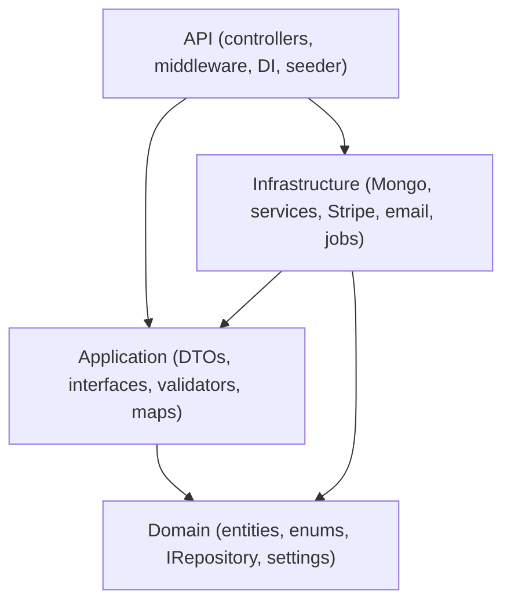
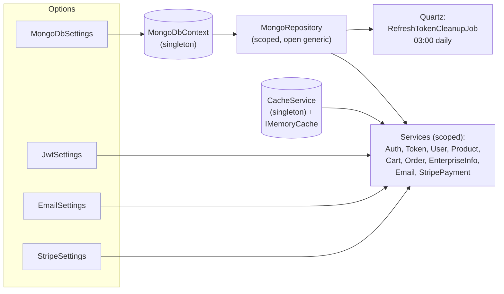
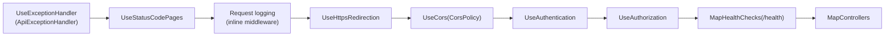
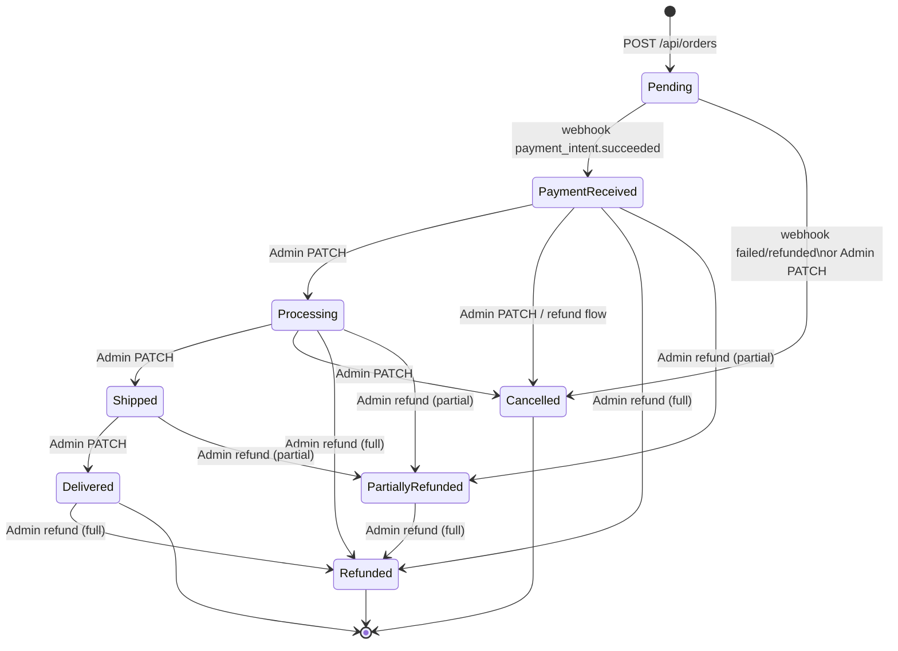
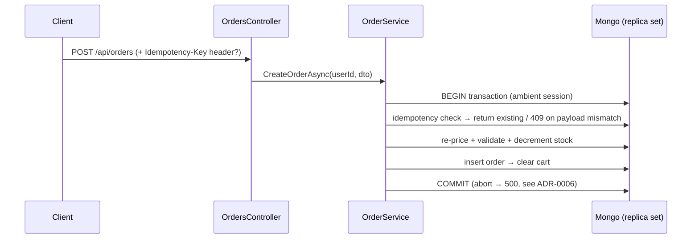

# ARCHITECTURE.md — VirtualStore system design

## Layers & dependency rule

`Domain` references nothing. `Application` references `Domain` only. `Infrastructure` implements Application interfaces. `API` wires everything and owns the request pipeline. Cross-layer shortcuts (e.g. controllers using `MongoRepository` directly, Stripe SDK types in DTOs) are forbidden.

## DI graph (representative)

AutoMapper is a singleton built from `MappingProfile` with `AssertConfigurationIsValid()` at startup — a broken map crashes boot, not a random request. `DatabaseSeeder` is scoped and runs after index creation.

## Request pipeline order (`Program.cs`)

Notes: exception handling is registered both as `AddProblemDetails` + `AddExceptionHandler` (services) and `UseExceptionHandler` (pipeline) so unhandled exceptions become RFC 7807 bodies. `MapOpenApi` + `MapScalarApiReference` run **only in Development**; the JWT Bearer scheme on that doc comes from `BearerSecuritySchemeTransformer` (also dev-only registration). Startup then ensures MongoDB indexes (non-fatal, warning on failure) and seeds the admin.

## Data & indexes

Collections are named `typeof(T).Name` — `User`, `Product`, `Category`, `Cart`, `Order`, `EnterpriseInfo`, `ProcessedWebhookEvent` (Stripe dedup). `MongoRepository<T>` is a thin driver wrapper; paging goes through `PagedAsync(predicate, page, size, sortBy, desc)` with server-side count.

| Index | Collection.field | Type | Why |
|---|---|---|---|
| `ux_user_email` | `User.Email` | unique asc | login lookup + duplicate prevention |
| `ux_cart_userId` | `Cart.UserId` | unique asc | one cart per user |
| `ix_order_userId` | `Order.UserId` | asc | order history (`GetUserOrdersAsync`) |
| `ux_order_userIdempotency` | `Order.(UserId, IdempotencyKey)` | unique sparse asc | idempotent checkout replay (ADR-0006) |
| `ux_webhookevent_eventId` | `ProcessedWebhookEvent.EventId` | unique asc | Stripe redelivery dedup (ADR-0007) |
| `ttl_webhookevent_receivedAt` | `ProcessedWebhookEvent.ReceivedAt` | TTL 30 d | age out dedup records |
| `ix_product_categoryId` | `Product.CategoryId` | asc | catalog filtering |
| `ix_category_parentCategoryId` | `Category.ParentCategoryId` | asc | category tree traversal |

`EnsureIndexesAsync` runs at every boot (idempotent `CreateOneAsync`). Money is `decimal` in Mongo; Stripe conversion to minor units happens only at the Stripe boundary.

## Order status machine

Enforced by `OrderService.AllowedTransitions`; illegal moves throw `InvalidOperationException` → `409`. Webhook-driven moves (`PaymentReceived`/`Cancelled`) and admin moves share the same guard, so the machine cannot be bypassed. Full refunds restore stock; partial refunds do not (discount/adjustment semantics, ADR-0007).

## Checkout (transactional, idempotent)

`MongoDbContext.TransactAsync` exposes the session ambiently (`AsyncLocal.CurrentSession`);
`MongoRepository<T>` enlists automatically — `IRepository<T>` is unchanged. Same `(userId, key)`
replays return the existing order; duplicate-key on insert (lost race) falls back to fetching
the winner. Order history and category listings page server-side via `PagedAsync` (100-cap).
Full rationale in ADR-0006 (supersedes the non-transactional caveats of ADR-0004).

Stripe I/O never enlists in the transaction: after commit, `OrderService` creates the
intent (deterministic key `order:{orderId}:intent`, `orderId` in metadata) and persists
the intent id — post-commit linkage with a retry path (`POST /api/payments/intent
{orderId}`). Redelivered webhooks collapse via `ProcessedWebhookEvent` (unique event id,
30-day TTL) before reaching the state machine. Full rationale in ADR-0007.

## Cross-cutting notes

- **Validation**: 19 FluentValidators + `AddFluentValidationAutoValidation` — invalid DTOs never reach services; `ValidationException` → `400` with `errors` map.
- **Caching**: `HybridCache` behind `ICacheService` (in-memory L1, optional Redis L2); OTP + email-confirm/reset tokens on `IDistributedCache` (10 min / 24 h / 1 h). Default TTL is 5-minute absolute (HybridCache has no sliding expiration). See ADR 0011.
- **Observability**: Serilog (console + daily file), `/health` (Mongo `ready`) + `/health/live`, `traceId` on every error, OpenTelemetry wired (ASP.NET Core + HttpClient + runtime; OTLP export opt-in via `Otlp:Endpoint`).
- **Rate limiting**: enforced per IP — `auth` 5/min, `webhook` 60/min, global 100/min (sliding window); `429` ProblemDetails with `Retry-After`, emitted before `ApiExceptionHandler`.
