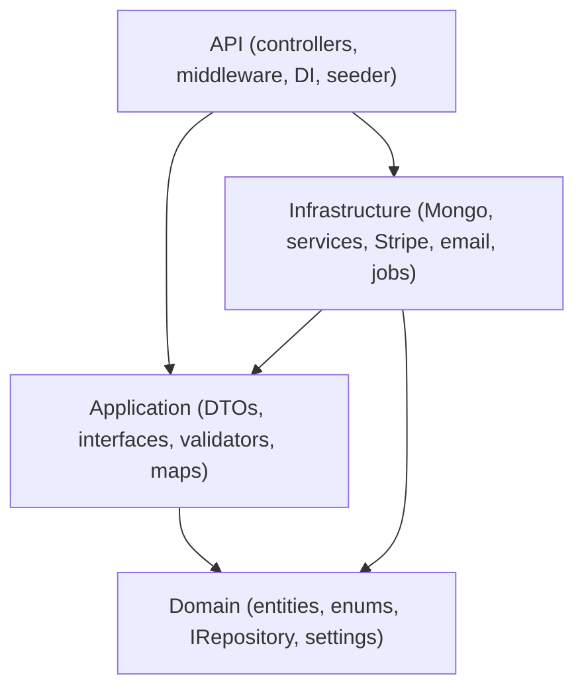
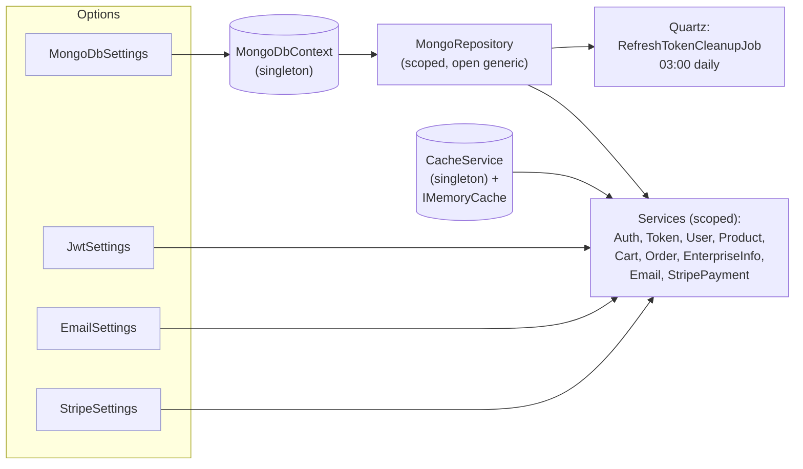
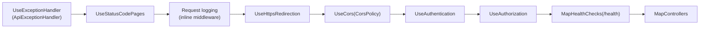
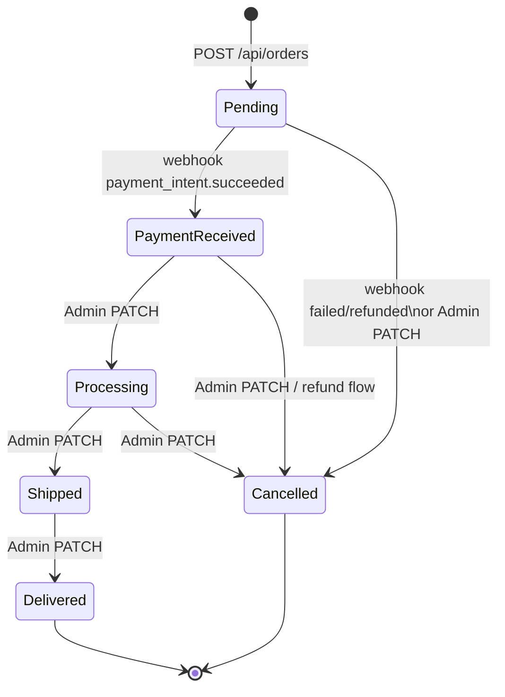

# ARCHITECTURE.md — VirtualStore system design

## Layers & dependency rule

`Domain` references nothing. `Application` references `Domain` only. `Infrastructure` implements Application interfaces. `API` wires everything and owns the request pipeline. Cross-layer shortcuts (e.g. controllers using `MongoRepository` directly, Stripe SDK types in DTOs) are forbidden.

## DI graph (representative)

AutoMapper is a singleton built from `MappingProfile` with `AssertConfigurationIsValid()` at startup — a broken map crashes boot, not a random request. `DatabaseSeeder` is scoped and runs after index creation.

## Request pipeline order (`Program.cs`)

Notes: exception handling is registered both as `AddProblemDetails` + `AddExceptionHandler` (services) and `UseExceptionHandler` (pipeline) so unhandled exceptions become RFC 7807 bodies. `MapOpenApi` + `MapScalarApiReference` run **only in Development**; the JWT Bearer scheme on that doc comes from `BearerSecuritySchemeTransformer` (also dev-only registration). Startup then ensures MongoDB indexes (non-fatal, warning on failure) and seeds the admin.

## Data & indexes

Collections are named `typeof(T).Name` — `User`, `Product`, `Category`, `Cart`, `Order`, `EnterpriseInfo`. `MongoRepository<T>` is a thin driver wrapper; paging goes through `PagedAsync(predicate, page, size, sortBy, desc)` with server-side count.

| Index | Collection.field | Type | Why |
|---|---|---|---|
| `ux_user_email` | `User.Email` | unique asc | login lookup + duplicate prevention |
| `ux_cart_userId` | `Cart.UserId` | unique asc | one cart per user |
| `ix_order_userId` | `Order.UserId` | asc | order history (`GetUserOrdersAsync`) |
| `ix_product_categoryId` | `Product.CategoryId` | asc | catalog filtering |
| `ix_category_parentCategoryId` | `Category.ParentCategoryId` | asc | category tree traversal |

`EnsureIndexesAsync` runs at every boot (idempotent `CreateOneAsync`). Money is `decimal` in Mongo; Stripe conversion to minor units happens only at the Stripe boundary.

## Order status machine

Enforced by `OrderService.AllowedTransitions`; illegal moves throw `InvalidOperationException` → `409`. Webhook-driven moves (`PaymentReceived`/`Cancelled`) and admin moves share the same guard, so the machine cannot be bypassed.

## Cross-cutting notes

- **Validation**: 13 FluentValidators + `AddFluentValidationAutoValidation` — invalid DTOs never reach services; `ValidationException` → `400` with `errors` map.
- **Caching**: single-node `IMemoryCache`; OTP (10 min) + OTP attempts (10 min, 5 max) + `CacheService` default 5-min sliding. No stampede protection — acceptable per ADR 0005; a distributed cache is the documented next step if the API scales out.
- **Observability (current merged state)**: Serilog (console + daily file), `/health` (Mongo `ready`), `traceId` on every error. OpenTelemetry/metrics are **in progress (wave 2f)** — see `docs/OPERATIONS.md`.
- **Rate limiting**: **in progress (wave 2f)** — `429` is reserved in the API contract but no limiter is merged yet.
